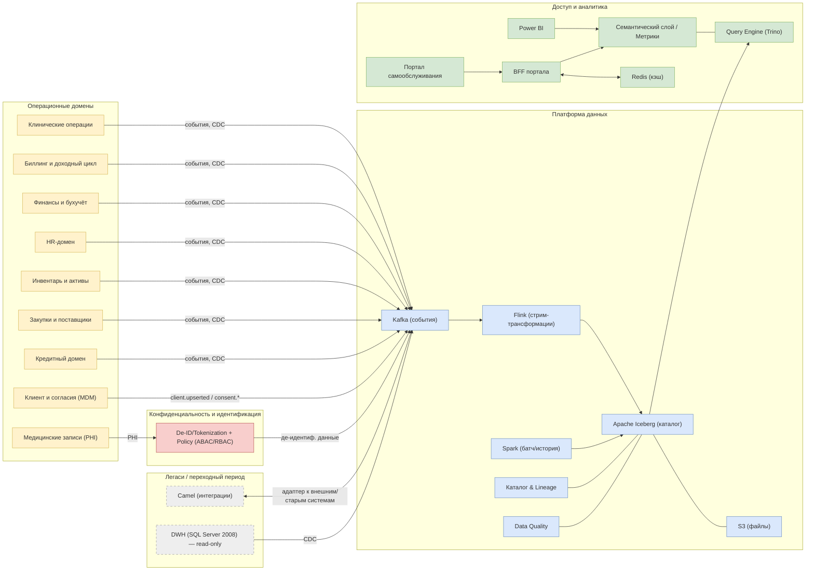

```mermaid
flowchart LR
classDef dom fill:#fff2cc,stroke:#d6b656,stroke-width:1px
classDef plat fill:#dae8fc,stroke:#6c8ebf,stroke-width:1px
classDef sec fill:#f8cecc,stroke:#b85450,stroke-width:1px
classDef anal fill:#d5e8d4,stroke:#82b366,stroke-width:1px
classDef leg fill:#eee,stroke:#999,stroke-width:1px,stroke-dasharray:5 5

subgraph DOM["Операционные домены"]
  CO["Клинические операции"]:::dom
  PHI["Медицинские записи (PHI)"]:::dom
  MDM["Клиент и согласия (MDM)"]:::dom
  BIL["Биллинг и доходный цикл"]:::dom
  FIN["Финансы и бухучёт"]:::dom
  CRE["Кредитный домен"]:::dom
  HR["HR-домен"]:::dom
  INV["Инвентарь и активы"]:::dom
  PRC["Закупки и поставщики"]:::dom
end

subgraph SEC["Конфиденциальность и идентификация"]
  DEID["De-ID/Tokenization + Policy (ABAC/RBAC)"]:::sec
end

subgraph PLAT["Платформа данных"]
  KAFKA["Kafka (события)"]:::plat
  FLINK["Flink (стрим-трансформации)"]:::plat
  SPARK["Spark (батч/история)"]:::plat
  ICE["Apache Iceberg (каталог)"]:::plat
  S3["S3 (файлы)"]:::plat
  CAT["Каталог & Lineage"]:::plat
  DQ["Data Quality"]:::plat
end

subgraph ANALYTICS["Доступ и аналитика"]
  SEM["Семантический слой / Метрики"]:::anal
  TRINO["Query Engine (Trino)"]:::anal
  BFF["BFF портала"]:::anal
  REDIS["Redis (кэш)"]:::anal
  PORTAL["Портал самообслуживания"]:::anal
  PBI["Power BI"]:::anal
end

subgraph LEGACY["Легаси / переходный период"]
  CAMEL["Camel (интеграции)"]:::leg
  DWH["DWH (SQL Server 2008) — read-only"]:::leg
end

%% Домены публикуют события/CDC в Kafka
CO -->|события, CDC| KAFKA
BIL -->|события, CDC| KAFKA
FIN -->|события, CDC| KAFKA
HR -->|события, CDC| KAFKA
INV -->|события, CDC| KAFKA
PRC -->|события, CDC| KAFKA
CRE -->|события, CDC| KAFKA
MDM -->|client.upserted / consent.*| KAFKA

%% PHI проходит через де-идентификацию
PHI -->|PHI| DEID
DEID -->|де-идентиф. данные| KAFKA

%% Легаси интеграции
CAMEL <--> |адаптер к внешним/старым системам| KAFKA
DWH -->|CDC | KAFKA

%% Поток в Lakehouse
KAFKA --> FLINK --> ICE
SPARK --> ICE
ICE --- S3
CAT --- ICE
DQ --- ICE

%% Доступ / сервинг
ICE --> TRINO
SEM --- TRINO
PBI --> SEM
PORTAL --> BFF --> SEM
BFF <--> REDIS

class CO,PHI,MDM,BIL,FIN,CRE,HR,INV,PRC dom
class CDC,KAFKA,FLINK,SPARK,ICE,S3,CAT,DQ plat
class SEM,TRINO,BFF,REDIS,PORTAL,PBI anal
class DEID sec
class CAMEL,DWH leg

```